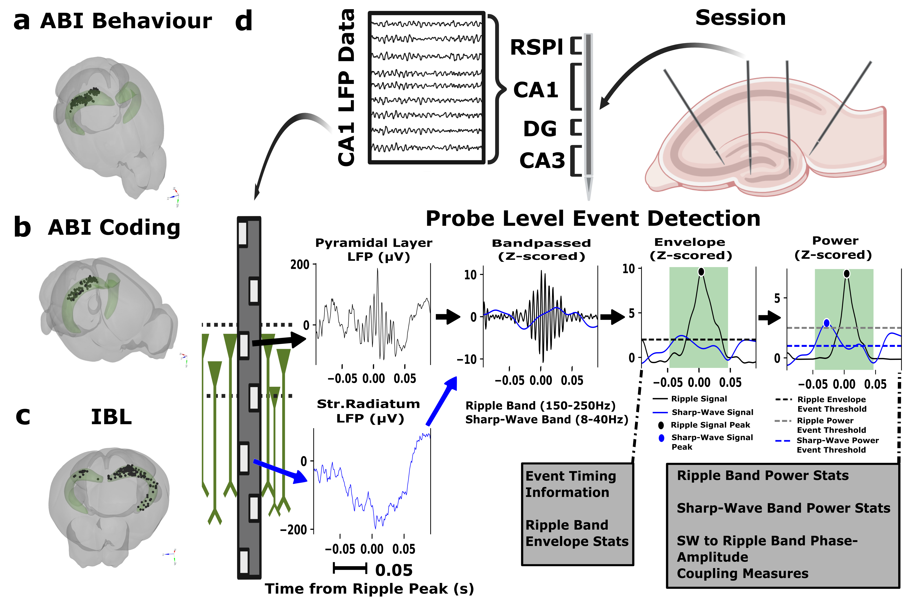

# Sharp Wave Ripple Dataset: Complete Column Documentation

This document provides documentation for all data files in Campbell, Murphy 2025, including column descriptions, units, data types, and computational notes. It is intended to describe the data itself in sufficient detail to run analyses with it.

## File Overview

The dataset contains CSV and JSON files which have been compressed with gzip.
- **CSV files**: Event data with detailed metrics.
- **JSON files**: Metadata and processing parameters, here we detail their structure as well.


*Schematic showing the output file structure for each SWR session, including event files, metadata, and channel selection information organized by probe and session. This illustrates how the various CSV and JSON files relate to each other within a session folder.*

## Putative SWR Events (`probe_{Probe_ID}_channel_{Channel_ID}_putative_swr_events.csv.gz`)

The Putative SWR Events table is comprised of Event Timing Information, Power Z-scores, Sharp Wave Metrics (computed from the sharp wave band of the putative stratum radiatum channel during events), the Envelope Metrics (provided by the `Karlsson_ripple_detector()` function in the `edeno` library), the Gamma Overlap, and the Movement Overlap. The columns here are presented in their order from left to right of the table.


*Overview figure (Figure 1 in manuscript) showing the dataset structure and probe placements across the three datasets (ABI Visual Behavior, ABI Visual Coding, and IBL), with a pictorial explanation of the detector pipeline illustrating how values in the Events CSV relate to source anatomy and electrophysiology data. Panels a-c show all individual putative pyramidal cell layer channel sites across the three datasets. Panel d presents an example single session with four probes, showing the annotated regions one probe passes through and a pictorial representation of CA1 LFP. Below this is a depiction of the anatomical sources of ripple band data (originating from the putative pyramidal cell layer) and sharp-wave band data (originating from apical dendrites in the putative stratum radiatum layer). Channel identification methods used in the pipeline are discussed in the channel selection metadata files section. The subsequent processing stages of the LFP are then depicted, with detailed information on data extraction, units, file types, and computation methods provided below.*

### Event Timing Information

All time is referenced to the session time that spiking, behavioral, and all other data in the session are set to as well.

| Column Name | Description | Units | Data Type | Notes |
|-------------|-------------|-------|-----------|-------|
| `start_time` | The start time of the SWR event | seconds | float64 | |
| `end_time` | The end time of the SWR event | seconds | float64 | |
| `duration` | The duration of the SWR event | seconds | float64 | |
| `power_peak_time` | Time of peak power within the SWR event | seconds | float64 | |

### Power Z-scores

These are computed from 150-250 Hz signal, smoothed on the envelope, then squared for power then z-scored.

| Column Name | Description | Units | Data Type | Notes |
|-------------|-------------|-------|-----------|-------|
| `power_max_zscore` | Maximum z-score of power during the event | z-score | float64 | |
| `power_median_zscore` | Median z-score of power during the event | z-score | float64 | |
| `power_mean_zscore` | Mean z-score of power during the event | z-score | float64 | |
| `power_min_zscore` | Minimum z-score of power during the event | z-score | float64 | |
| `power_90th_percentile` | 90th percentile of power z-score during the event | z-score | float64 | |

### Sharp Wave Metrics

Power computed from 8-40 Hz signal. Smoothing is done on the envelope before squaring for power. Z-score is then reported.

| Column Name | Description | Units | Data Type | Notes |
|-------------|-------------|-------|-----------|-------|
| `sw_exceeds_threshold` | Boolean indicating if sharp wave exceeds detection threshold | - | bool | |
| `sw_peak_power` | Peak power of the sharp wave component | z-score | float64 | |
| `sw_peak_time` | Time of peak sharp wave power | seconds | float64 | |

### Sharp Wave-Ripple Coupling

This is done on a per-event basis using phase computed by the scipy.signal `hilbert()` function. Here power was not z-scored before using it to compute the cross-frequency phase-amplitude coupling.

| Column Name | Description | Units | Data Type | Notes |
|-------------|-------------|-------|-----------|-------|
| `sw_ripple_plv` | Phase-locking value between sharp wave and ripple components | - | float64 | Ranges from 0-1, 0 being no synchrony, 1 being perfect synchrony. |
| `sw_ripple_mi` | Modulation index between sharp wave and ripple | - | float64 | A measure of how much ripple amplitude distribution deviates from uniform across sharp wave phase bins. Normalized, therefore unitless mutual information between ripple amplitude and sharp wave phase. Ranges 0-1.|
| `sw_ripple_clcorr` | Circular-linear Correlation between sharp wave phase and ripple power| correlation coefficient | float64 | The linear relationship between circular sharp wave phase and ripple amplitude; differs from regular correlation due to circular nature of phase. Ranges -1 to +1. |

### Envelope Metrics

These come from the `Karlsson_ripple_detector()` function in the `edeno` ripple detection library. They are computed from the 150-250 Hz signal, filtered with the `ripple_filter()` method, then smoothed on the envelope with a half-Gaussian kernel, then z-scored. The metrics including area are computed from the z-score.  We have removed the speed column they provided.

| Column Name | Description | Units | Data Type | Notes |
|-------------|-------------|-------|-----------|-------|
| `envelope_peak_time` | Time of peak envelope amplitude | seconds | float64 | |
| `envelope_max_thresh` | Maximum envelope threshold value | z-score | float64 | |
| `envelope_mean_zscore` | Mean z-score of envelope amplitude | z-score | float64 | |
| `envelope_median_zscore` | Median z-score of envelope amplitude | z-score | float64 | |
| `envelope_max_zscore` | Maximum z-score of envelope amplitude | z-score | float64 | |
| `envelope_min_zscore` | Minimum z-score of envelope amplitude | z-score | float64 | |
| `envelope_area` | Area under the envelope curve | z-score·s | float64 | |
| `envelope_total_energy` | Total energy of the envelope signal | z-score²·s | float64 | |
| `envelope_90th_percentile` | 90th percentile of envelope amplitude | z-score | float64 | |

### Gamma Overlap

Gamma band was defined as 20-80 Hz. If power was above a z-scored threshold, this was labeled a gamma band event. See gamma artifact events table description for more details.

| Column Name | Description | Units | Data Type | Notes |
|-------------|-------------|-------|-----------|-------|
| `overlaps_with_gamma` | Boolean indicating if SWR overlaps with gamma oscillations | - | bool | |
| `gamma_overlap_percent` | Percentage of SWR duration that overlaps with gamma | percentage | float64 | |

### Movement Overlap

The ripple detector was also run on two randomly selected non-hippocampal channels to detect simultaneous high frequency events outside of the hippocampus. See movement event artifacts table description for more details.

| Column Name | Description | Units | Data Type | Notes |
|-------------|-------------|-------|-----------|-------|
| `overlaps_with_movement` | Boolean indicating if SWR overlaps with movement periods | - | bool | |
| `movement_overlap_percent` | Percentage of SWR duration that overlaps with movement | percentage | float64 | |


*Example showing how movement artifacts are detected by comparing ripple band activity in CA1 channels (top) versus control channels outside the hippocampus (bottom). True SWR events show increased ripple power only in CA1 channels, while movement artifacts show simultaneous increases across all channels.*

### Understanding Putative SWR Events Data

The putative SWR events represent the complete set of detected high-frequency events before final filtering. Each event contains comprehensive metrics that allow researchers to apply their own quality criteria:

**Event Quality Assessment:**
- Events with high `power_max_zscore` (>3 SD) and `sw_exceeds_threshold=True` represent high-confidence SWRs
- Events with `overlaps_with_gamma=True` or `overlaps_with_movement=True` may be artifacts
- The `sw_ripple_mi` and `sw_ripple_plv` metrics quantify phase-amplitude coupling between sharp wave and ripple components

**Filtering Recommendations:**
- Minimum ripple power: 3 SD (following Liu et al. consensus guidelines)
- Minimum sharp wave power: 1 SD for true SWRs
- Exclude events with gamma or movement overlap for high-confidence analysis
- Maximum power threshold of 10 SD to exclude potential artifacts


*Sankey diagram showing the filtering pipeline flow, illustrating how putative events are processed through various quality criteria to identify high-confidence SWR events.*

## Movement Artifacts (`probe_{Probe_ID}_channel_{Channel_ID}_movement_artifacts.csv.gz`)

The ripple detector was also run on two randomly selected non-hippocampal channels to detect simultaneous high frequency events outside of the hippocampus. These are the fields directly provided by the `Karlsson_ripple_detector()` function in the `edeno` library, though we removed the speed column. The signal is filtered to between 150 and 250 Hz, then the envelope is computed from the Hilbert transform, smoothed, and z-scored. From the z-score, the min, max, median, mean, area, and total energy are computed. Used to produce the Movement Overlap fields in the Putative SWRs table. 

**Note on column names: All the descriptive stats in this CSV are related to the envelope, not the power.  This CSV file is the direct output of the `Karlsson_ripple_detector()` function and we did not modify it's output unlike the Putative SWR Events CSV.**

| Column Name | Description | Units | Data Type | Notes |
|-------------|-------------|-------|-----------|-------|
| `start_time` | The start time of the movement artifact | seconds | float64 | |
| `end_time` | The end time of the movement artifact | seconds | float64 | |
| `duration` | The duration of the movement artifact | seconds | float64 | |
| `max_thresh` | Maximum envelope threshold value | μV | float64 | |
| `mean_zscore` | Mean z-score of envelope amplitude | z-score | float64 | |
| `median_zscore` | Median z-score of envelope amplitude | z-score | float64 | |
| `max_zscore` | Maximum z-score of envelope amplitude | z-score | float64 | |
| `min_zscore` | Minimum z-score of envelope amplitude | z-score | float64 | |
| `area` | Area under the envelope curve | z-score·s | float64 | |
| `total_energy` | Total energy of the envelope signal | z-score²·s | float64 | |

## Gamma Band Events (`probe_{Probe_ID}_channel_{Channel_ID}_gamma_band_events.csv.gz`)

Here we filter using the fast Fourier transform for between 20-80 Hz from the putative pyramidal cell layer channel. Filtering is done with the `fftconvolve()` function from the `scipy.signal` module. The envelope is then computed from the Hilbert transform of the filtered LFP. A half-Gaussian smoothing operation takes place, and then we compute the power from this and z-score it. If the signal was above an SD threshold set in the `united_detector_config.yaml`, then this was considered a gamma band event and is represented with a row in this table. Used to produce the Gamma Overlap field in the Putative SWRs table. The threshold we chose was based on Frank & Kai (2008) which chose 3 SD as its threshold.

| Column Name | Description | Units | Data Type | Notes |
|-------------|-------------|-------|-----------|-------|
| `start_time` | The start time of the gamma event | seconds | float64 | |
| `end_time` | The end time of the gamma event | seconds | float64 | |
| `duration` | The duration of the gamma event | seconds | float64 | |


*Example showing simultaneous detection of gamma band activity (20-80 Hz, purple) and ripple band activity (150-250 Hz, black) in CA1 LFP. The top panel shows raw LFP with filtered signals, while the bottom panel shows z-scored power traces. Gamma events that overlap with ripple events are flagged as potential false positives.*

## Global SWR Events (`session_{Session_ID}_global_swr_events.csv.gz`)

Global SWR events are detected when putative SWR events occur simultaneously across multiple probes within a specified time window. These represent network-level sharp wave ripple events that span across recording sites.


*Example of a global SWR event visualization showing the event across multiple probes. Each subplot shows one probe with raw LFP (gray) and ripple power (black). The green shaded area indicates the global event duration, while dashed vertical lines show individual probe peak times. This demonstrates how global events capture coordinated activity across the hippocampal network.*

| Column Name | Description | Units | Data Type | Notes |
|-------------|-------------|-------|-----------|-------|
| `Unnamed: 0` | Row index from original dataset | - | int64 | |
| `start_time` | The start time of the global SWR event | seconds | float64 | |
| `end_time` | The end time of the global SWR event | seconds | float64 | |
| `duration` | The duration of the global SWR event | seconds | float64 | |
| `participating_probes` | Array of probe IDs that contributed to this global event | - | object (array as string) | Probe identifiers as strings |
| `peak_times` | Array of peak times from each contributing probe | seconds | object (array as string) | One peak time per contributing probe |
| `peak_powers` | Array of peak powers from each contributing probe | z-score | object (array as string) | Peak power values corresponding to peak_times |
| `probe_event_file_index` | Array of event indices for each contributing probe event, so if in participating probes ['1234','4323'] and in `probe_event_file_index` you had [5,7] it means the global event consists of event 5 from probe '1234' and event 7 from probe '4323' | - | object (array as string) | Used for cross-referencing with individual probe files |
| `probe_count` | Number of probes that contributed to this global event | count | int64 | |
| `global_peak_time` | Time of maximum power across all contributing probes | seconds | float64 | |
| `global_peak_power` | Maximum power value across all contributing probes | z-score | float64 | |
| `peak_probe` | Probe ID that had the maximum power for this global event | - | int64 | |

### Understanding Global Events Data Structure

The global events file serves as an index that links individual probe events into network-level phenomena. Key features:

**Cross-referencing with Individual Events:**
- Use `probe_event_file_index` to find the corresponding row in each probe's individual events file
- Example: If `participating_probes = ['1044506935', '1044506936']` and `probe_event_file_index = [8, 6]`, then this global event consists of event #8 from probe 1044506935's file and event #6 from probe 1044506936's file

**Temporal Relationships:**
- `global_peak_time` represents the time of maximum power across all probes
- Individual `peak_times` show when each probe reached its peak during the global event
- Time differences between probe peaks can indicate propagation direction

**Event Quality:**
- Higher `global_peak_power` values indicate stronger network-level events
- More `participating_probes` suggest broader network involvement
- Events can be filtered by minimum probe count or power thresholds

## Probe Metadata (`session_{Session_ID}_probe_metadata.csv.gz`)

| Column Name | Description | Units | Data Type | Notes |
|-------------|-------------|-------|-----------|-------|
| `probe_id` | Unique identifier for the probe | - | string | |
| `total_unit_count` | Total number of units recorded on this probe | count | int64 | |
| `good_unit_count` | Number of good quality units on this probe | count | int64 | |
| `ca1_total_unit_count` | Total CA1 units on this probe | count | int64 | |
| `ca1_good_unit_count` | Good quality CA1 units on this probe | count | int64 | |


## Hierarchical JSON Files

### Selection Metadata (`probe_{Probe_ID}_channel_selection_metadata.json.gz`)
**Format**: JSONL (JSON Lines) - each line is a separate JSON object

**Structure per line**:
```json
{
  "probe_id": "string",
  "ripple_band": {
    "channel_ids": ["array of int64"],
    "depths": ["array of float64"],
    "skewness": ["array of float64"],
    "net_power": ["array of float64"],
    "selected_channel_id": "int64",
    "selection_method": "string"
  },
  "sharp_wave_band": {
    "channel_ids": ["array of int64"],
    "depths": ["array of float64"],
    "net_sw_power": ["array of float64"],
    "modulation_index": ["array of float64"],
    "circular_linear_corrs": ["array of float64"],
    "selected_channel_id": "int64",
    "selection_method": "string"
  }
}
```

| Field | Description | Units | Data Type | Notes |
|-------|-------------|-------|-----------|-------|
| `probe_id` | Unique identifier for the probe | - | string | |
| `channel_ids` | Array of channel IDs for this band | - | array[int64] | |
| `depths` | Electrode depths in micrometers | μm | array[float64] | |
| `skewness` | Signal skewness per channel | - | array[float64] | |
| `net_power` | Net power per channel | μV² in 150-250 Hz | array[float64] | Summed over entire recording. |
| `selected_channel_id` | ID of the selected channel | - | int64 | |
| `selection_method` | Method used for channel selection | - | string | |
| `net_sw_power` | Net sharp wave power per channel | μV² in 8-40 Hz | array[float64] | Summed over entire recording. |
| `modulation_index` | Cross-frequency phase-amplitude coupling per channel | - | array[float64] | Summed over entire recording. Computed across times when z-scored ripple power and sharp-wave power were greater than 1 SD in both channels. |
| `circular_linear_corrs` | Cross-frequency phase-amplitude coupling per channel | correlation coefficient | array[float64] | Summed over entire recording. Computed across times when z-scored ripple power and sharp-wave power were greater than 1 SD in both channels. |


*Visualization of channel selection methodology showing net ripple power-based selection for pyramidal layer identification (left) and modulation index-based selection for mid stratum radiatum layer identification (right). The plots demonstrate how different channels are evaluated and selected based on their electrophysiological signatures.*

### Run Settings (`session_{Session_ID}_run_settings.json.gz`)

**Format**: Single JSON object

**Structure**:
```json
{
  "run_name": "string",
  "thresholds": {
    "gamma_event_thresh": "float64",
    "ripple_band_threshold": "float64",
    "movement_artifact_ripple_band_threshold": "float64",
    "merge_events_offset": "float64"
  },
  "global_swr_detection": {
    "min_ca1_units": "int64",
    "min_events_per_probe": "int64",
    "min_filtered_events": "int64",
    "min_sw_power": "float64",
    "merge_window": "float64",
    "min_probe_count": "int64",
    "exclude_gamma": "bool",
    "exclude_movement": "bool",
    "global_rip_label": "string"
  },
  "dataset": "string",
  "sampling_rates": {
    "target_fs": "float64"
  }
}
```

| Field | Description | Units | Data Type | Notes |
|-------|-------------|-------|-----------|-------|
| `run_name` | Name identifier for this processing run | - | string | |
| `gamma_event_thresh` | Z-score threshold for gamma event detection | z-score | float64 | |
| `ripple_band_threshold` | Z-score threshold for ripple detection | z-score | float64 | |
| `movement_artifact_ripple_band_threshold` | Z-score threshold for movement artifact detection | z-score | float64 | |
| `merge_events_offset` | Time window for merging nearby events | seconds | float64 | |
| `min_ca1_units` | Minimum CA1 units required | count | int64 | |
| `min_events_per_probe` | Minimum events per probe | count | int64 | |
| `min_filtered_events` | Minimum filtered events required | count | int64 | |
| `min_sw_power` | Minimum sharp wave power threshold | μV² | float64 | |
| `merge_window` | Time window for merging global events | seconds | float64 | |
| `min_probe_count` | Minimum number of probes required | count | int64 | |
| `exclude_gamma` | Whether to exclude gamma overlapping events | - | bool | |
| `exclude_movement` | Whether to exclude movement overlapping events | - | bool | |
| `global_rip_label` | Label for global ripple events | - | string | |
| `dataset` | Dataset identifier | - | string | |
| `target_fs` | Target sampling frequency | Hz | float64 | |

## Data Validation and Quality Assessment

### Event Quality Distributions

The dataset has been validated against established electrophysiological criteria. Following Liu et al. consensus guidelines, authentic SWR events should exhibit lognormal distributions for both duration and power metrics.


*Technical validation showing that SWR events follow expected lognormal distributions for duration and power across all three datasets (ABI Visual Behavior, ABI Visual Coding, and IBL). Events also occur primarily during periods of low theta power and minimal movement, confirming their authenticity. Statistical tests (Kolmogorov-Smirnov) confirm significant fits to lognormal distributions.*

### Artifact Detection Examples

The dataset includes comprehensive artifact detection to distinguish genuine SWRs from false positives:

**Movement Artifacts:** Detected by comparing ripple band activity between CA1 channels and control channels outside the hippocampus. True SWRs show selective CA1 activation, while movement artifacts appear across all channels simultaneously.

**Gamma Contamination:** High-frequency gamma bursts (20-80 Hz) can contaminate ripple band measurements. Events overlapping with gamma activity are flagged in the `overlaps_with_gamma` column.

### Pipeline Flexibility

One key advantage of this dataset structure is that global events can be rapidly regenerated with different parameters without reprocessing the computationally expensive LFP filtering steps:

- **Merge window**: Time tolerance for considering events simultaneous (default 50ms)
- **Minimum probe count**: Required number of probes for global event detection
- **Power thresholds**: Minimum ripple and sharp wave power criteria
- **Artifact exclusion**: Toggle gamma and movement artifact filtering

This flexibility allows researchers to explore different definitions of "global" hippocampal events and optimize parameters for their specific research questions.
