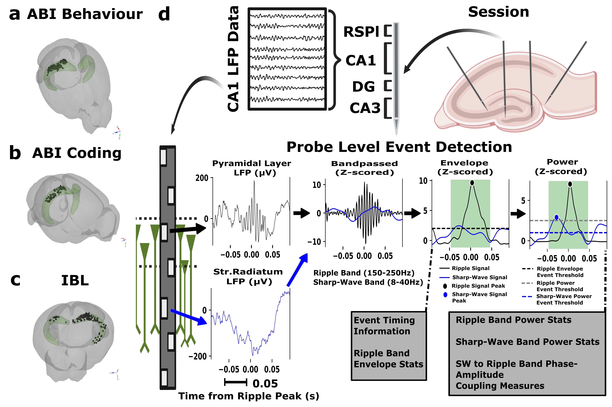
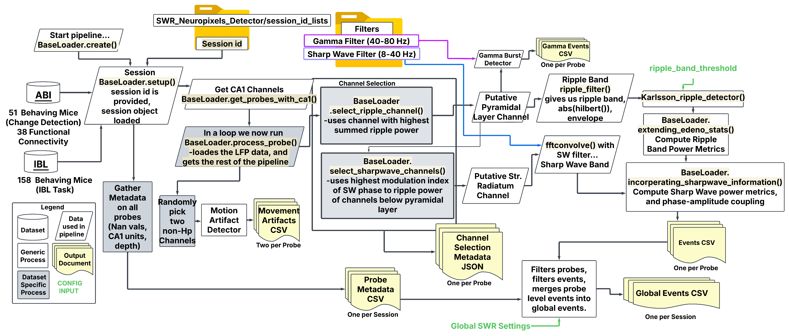
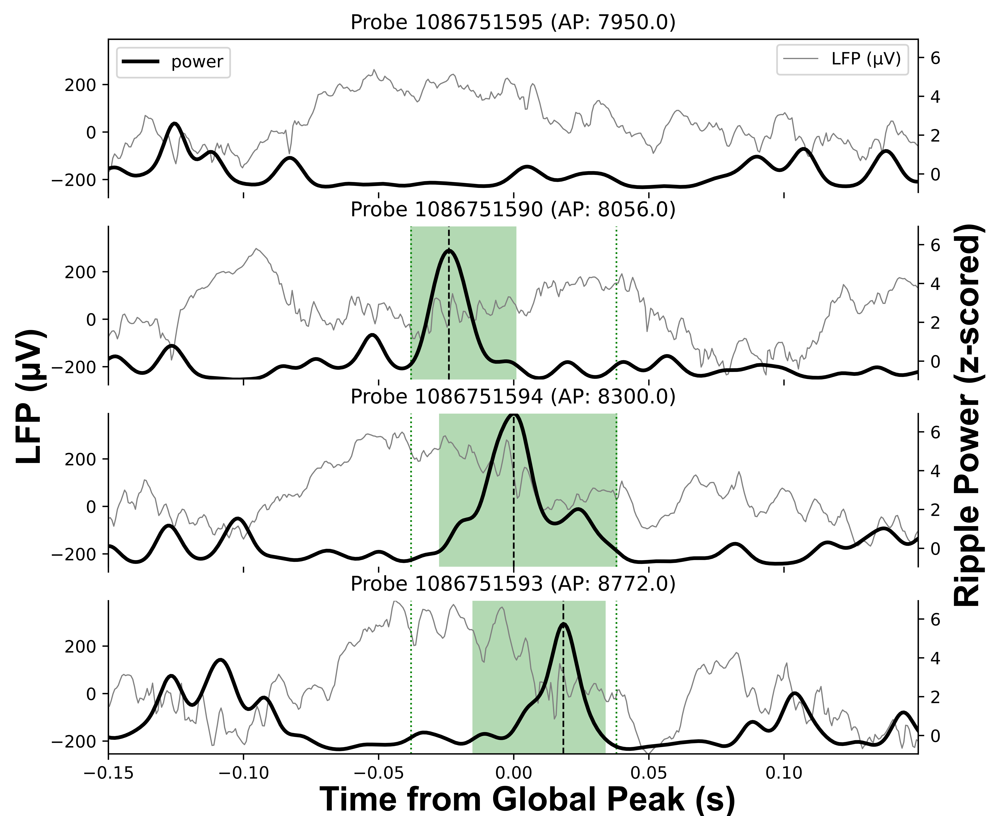
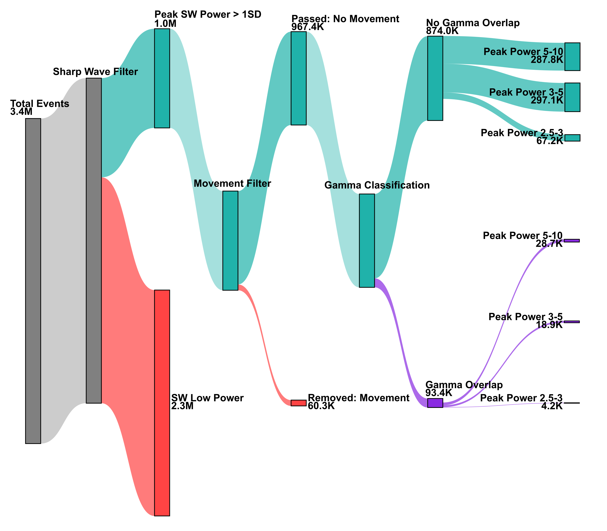

# Mouse Hippocampal Sharp Wave Ripple Dataset Curated From Public Neuropixels Datasets


*Overview figure showing the dataset structure and probe placements across the three datasets (ABI Visual Behavior, ABI Visual Coding, and IBL), with a pictoral explanation of the detector pipeline showing how the values in the Events CSV relates to source data of the anatomy and electrophysiology.*


*Detailed workflow diagram showing the SWR detection pipeline steps and data flow, including preprocessing, detection, filtering, and output generation stages.*

## Description
A repo showcasing how to process and analyze Neuropixels LFP from the two largest publicly available datasets: the ABI Visual Behaviour and the IBL dataset.  Currently both the IBL and ABI datasets are missing NWB files on DANDI archive.  Once they are done I'd like to switch to a single pipeline that processes all of them but right now we have to use the individual APIs to get the full datasets.

The data set is available at the [OSF](https://osf.io/9gm6x/).

## How to get started...

### 1. Clone the Repository

First, you'll need Git and this repository to access the environment files and pipeline code:

#### Install Git (if not already installed)

**Linux (Ubuntu/Debian):**
```bash
sudo apt update && sudo apt install git
```

**macOS:**
```bash
# Using Homebrew (install Homebrew first if needed: https://brew.sh/)
brew install git

# Or download from: https://git-scm.com/download/mac
```

**Windows:**
```bash
# Download Git for Windows from: https://git-scm.com/download/win
# Or use Windows Subsystem for Linux (WSL)
```

#### Clone this Repository
```bash
git clone https://github.com/AllenInstitute/NeuropixelsLFPOnRamp.git
cd NeuropixelsLFPOnRamp
```

### 2. Setup Environments

#### Install Conda/Mamba (Required)

First, install a conda distribution. We recommend **Miniforge** or **Mambaforge** over Anaconda Distribution due to recent licensing changes:

**Option A: Miniforge (Recommended)**
```bash
# Download and install Miniforge (includes conda-forge by default)
curl -L -O "https://github.com/conda-forge/miniforge/releases/latest/download/Miniforge3-$(uname)-$(uname -m).sh"
bash Miniforge3-$(uname)-$(uname -m).sh
```

**Option B: Miniconda (Alternative)**
```bash
# Download from: https://www.anaconda.com/docs/getting-started/miniconda/main
# Follow installation instructions for your operating system
```

**Option C: Mambaforge (Fastest)**
```bash
# Download and install Mambaforge (includes mamba for faster package resolution)
curl -L -O "https://github.com/conda-forge/miniforge/releases/latest/download/Mambaforge-$(uname)-$(uname -m).sh"
bash Mambaforge-$(uname)-$(uname -m).sh
```

For more details on conda installation, see the [official Miniconda documentation](https://www.anaconda.com/docs/getting-started/miniconda/main).

#### Create Analysis Environments

After installing conda/mamba, set up the required environments for data analysis.

**Recommended: Automated Setup**

Use the provided setup script to automatically create both required environments:

```bash
Setup/setup_environments.sh
```

This script works with Miniconda, Mambaforge, or Anaconda and creates both `allensdk_env` and `ONE_ibl_env` environments with all necessary packages. See [Setup/README.md](Setup/README.md) for details on what the script does.

**Alternative: Manual Environment Creation**

If you prefer manual setup or encounter issues with the automated script:

```bash
# For Allen Institute datasets
conda env create -f Setup/allensdk_environment.yml
conda activate allensdk_env

# For IBL datasets  
conda env create -f Setup/ibl_environment.yml
conda activate ONE_ibl_env

# For general analysis and visualization
conda env create -f Setup/analysis_environment.yml
conda activate analysis_env
```

**Note on Licensing**: Anaconda Distribution requires paid licenses for commercial use (companies with 200+ employees). Our environment files are designed to work with conda-forge channels to avoid licensing restrictions. If you encounter issues with the "defaults" channel, use Miniforge or Mambaforge which default to conda-forge.

For detailed environment setup instructions and troubleshooting, see the [Setup README](Setup/README.md).

### 3. Download the Dataset

The processed SWR dataset is available from OSF:

```bash
# Download the complete dataset (~XX GB)
wget -O "CampbellMurphy2025_SWRs_data.zip" "https://files.osf.io/v1/resources/9gm6x/providers/osfstorage/?zip="

# Extract the dataset
unzip CampbellMurphy2025_SWRs_data.zip
```

The dataset is also available at the [OSF project page](https://osf.io/9gm6x/).

### 4. Explore the Data

Start with these key resources:

- **Data Usage Tutorials**: [Data_Usage/](Data_Usage/) - Interactive notebooks and tutorials
- **Data Documentation**: [Data_Usage/DATA_DOCUMENTATION.md](Data_Usage/DATA_DOCUMENTATION.md) - Complete column descriptions and data structure
- **Global Events Tutorial**: [Data_Usage/global_swr_events_tutorial.py](Data_Usage/global_swr_events_tutorial.py) - Step-by-step analysis of network-level events

### 5. If you wish to customize the detection pipeline...

To rerun detection with different thresholds or modify the pipeline:

- See [SWR_Neuropixels_Detector/README.md](SWR_Neuropixels_Detector/README.md) for pipeline configuration
- Modify parameters in `united_detector_config.yaml`
- Configure environment variables and use `run_pipeline.sh` with appropriate flags

#### Environment Variables Configuration

Before running the pipeline, you must configure these essential environment variables in the `run_pipeline.sh` script:

```bash
# Output directory for all results - where all SWR detection results will be saved
export OUTPUT_DIR="your/path_to/output_directory"

# Cache directories for datasets - these store raw data downloaded by the APIs/SDKs
export ABI_VISUAL_CODING_SDK_CACHE="your/path_to/ABI_visual_coding_cache"
export ABI_VISUAL_BEHAVIOUR_SDK_CACHE="your/path_to/ABI_visual_behavior_cache"
export IBL_ONEAPI_CACHE="your/path_to/IBL_data_cache"

# Run name for tracking different pipeline runs and their settings
export RUN_NAME="run_name_here_$(date +%Y%m%d_%H%M%S)"
```

Then you just run the pipeline. The pipeline's default settings save channel selection metadata but do not save LFP data or overwrite existing results. See the [SWR_Neuropixels_Detector/README.md](SWR_Neuropixels_Detector/README.md) for detailed configuration options, command-line flags, troubleshooting tips, and debugging instructions if you wish to modify the python code.

```bash
cd SWR_Neuropixels_Detector/ 
./run_pipeline.sh
```

**Important Notes:**

- **Cache Directories**: These are where the Allen SDK and IBL ONE-API store downloaded raw neurophysiology data. Each dataset API maintains its own cache to avoid re-downloading large files. Set these to locations with sufficient storage space (hundreds of GB).  Some of the `run_pipeline.sh` flags allow this data to be cleaned up as the pipeline is running to save the users storage space.

- **Output Directory**: All SWR detection results, including session-level events, metadata, and global events, will be organized under this directory by dataset.

- **Run Name**: Used to track pipeline settings across different runs. Consider including date/time (e.g., `"swr_detection_20240315_v2"`). The detection thresholds from the config file are stored with each session's output, allowing you to trace results back to specific parameter settings.

- **Session Organization**: The pipeline processes data in "sessions" - the fundamental unit of neurophysiology recordings following NWB and Alyx standards. Each of the three datasets (ABI Visual Behavior, ABI Visual Coding, IBL) contains multiple sessions, and results are organized by session within each dataset folder.

Please refer to Figure 3 as well as the `DATA_DESCRIPTION.md`, and the tutorials in `/Data_Usage` to better understand how we have structured the events tables, artifacts tables (for movement and gamma artifacts), as well as the metadata for probe selection and run settings.


## Repo Table of Contents

| Section | Description | README |
|---------|-------------|--------|
| [**Data_Usage/**](Data_Usage/) | Interactive tutorials for data exploration and analysis | [📖 README](Data_Usage/README.md) |
| [**SWR_Neuropixels_Detector/**](SWR_Neuropixels_Detector/) | Main SWR detection pipeline with configurable parameters | [📖 README](SWR_Neuropixels_Detector/README.md) |
| [**Setup/**](Setup/) | Conda environment configurations for different datasets | [📖 README](Setup/README.md) |
| [**Figures_Tables_and_Technical_Validation/**](Figures_Tables_and_Technical_Validation/) | Publication figures, technical validation, and analysis scripts | [📖 README](Figures_Tables_and_Technical_Validation/README.md) |
| [**RepoImages/**](RepoImages/) | Documentation images and publication figures | - |

### Section Descriptions

### Data_Usage

Contains tutorials for understanding and analyzing Sharp Wave Ripple (SWR) data at different scales:

- **`swrs_allen_visual_behaviour.ipynb`**: Demonstrates single-session data alignment and analysis, showing how to load and organize SWR data for individual recording sessions. Useful for understanding data structure and performing preliminary analyses.

- **`choosing_event_thresholds.ipynb`**: Establishes methods for threshold testing and provides infrastructure for dataset-level analyses. Includes the `SharpWaveComponentPlotter` object for managing data across multiple sessions and datasets, enabling cross-dataset comparisons and formal hypothesis testing.

### SWR_Neuropixels_Detector

Contains the main pipeline for running the detection scripts. It includes a config file (`united_detector_config.yaml`) which sets input and output paths, parameters for detection (e.g., ripple envelope threshold), and filtering options. If one wishes to rerun the detection pipelines, this config file can be modified accordingly. There is also a `run_pipeline.sh` script to execute the different stages of the pipeline.

#### Example Usage
1. **Configure Environment Variables**: Edit the environment variables at the top of `SWR_Neuropixels_Detector/run_pipeline.sh`:
    ```bash
    # Example configuration
    export OUTPUT_DIR="/data/swr_results"
    export ABI_VISUAL_CODING_SDK_CACHE="/data/allen_cache/visual_coding"
    export ABI_VISUAL_BEHAVIOUR_SDK_CACHE="/data/allen_cache/visual_behavior"
    export IBL_ONEAPI_CACHE="/data/ibl_cache"
    export RUN_NAME="swr_detection_$(date +%Y%m%d_%H%M%S)"
    ```

2. Start a `tmux` session (as the code can take a while to run):
    ```bash
    tmux
    ```

3. Change directory to the pipeline folder:
    ```bash
    cd SWR_Neuropixels_Detector
    ```

4. Ensure the config file, `united_detector_config.yaml`, is set correctly, including the number of cores (`pool_sizes`) your machine can handle for each dataset.

5. Run the pipeline script. The script automatically activates the appropriate conda environment for each dataset:
    ```bash
    # Run all datasets
    ./run_pipeline.sh
    
    # Run specific dataset(s)
    ./run_pipeline.sh subset ibl
    ./run_pipeline.sh subset ibl,abi_visual_behaviour
    
    # Run with additional options
    ./run_pipeline.sh subset ibl --save-lfp --overwrite-existing
    ```

6. Use `ctrl+b, d` to exit the tmux session without killing it. It is recommended to check `htop` to ensure the server is behaving appropriately.

Note:  We have also created scripts for running the pipelines on slurm for shared computing clusters.  (Will be provided)

#### SWR session folder structure

The code outputs the following set of files for each session.

*Schematic showing the output file structure for each SWR session, including event files, metadata, and channel selection information organized by probe and session.*

#### Filters

Contains the filters and a readme displaying the code used to create the filters for the SWR detection pipelines.  Uses environment for [mne package with core dependencies](https://mne.tools/stable/install/manual_install.html#installing-mne-python-with-core-dependencies).

### Figures_Tables_and_Technical_Validation

Contains scripts and workflows for generating publication figures and technical validation analyses. The subfolders contain automated pipelines that generate multiple visualizations for selection:

- **`probe_selection_validation/`**: Contains scripts for analyzing channel selection metadata and generating depth-dependent plots showing ripple band power, skewness, and sharp wave features across probe depths. Includes automated workflows for creating bar plots and selection visualizations.

- **`CSD_plot/`**: Contains workflows and tools for computing and visualizing Current Source Density (CSD) from LFP data during SWR events. Includes main workflows for individual SWR event CSD analysis and trial-averaged CSD analysis, plus a validation notebook using IBL data with higher sampling rates. Implements second spatial derivative method to reveal current sources and sinks, with multiple smoothing options for noise reduction. Generates individual event CSD plots and trial-averaged CSD plots, providing insights into the laminar organization of SWR events in the hippocampus. Figure 5A CSD plots from IBL data showing laminar organization of SWR events, as well as trial averaged CSD plots form ABI Visual Behaviour for single probes.

- **`Sharp_wave_component_validation/`**: Contains the `SWRExplorer.py` tool and workflows for finding and visualizing the best SWR events across datasets. Includes scripts for generating multiple event visualizations and selecting the most representative examples for publication.

- **`Relating_SWR_to_other_data/`**: Contains scripts for relating SWR events to spiking activity, pupil data, and running behavior. Includes automated workflows for generating multiple raster plots and behavioral correlation analyses.

- **`Sankey_plots/`**: Contains code to generate Sankey diagrams visualizing the filtering pipeline for SWR events, showing how events flow through different filters and classifications.

- **`Mouse_subject_details/`**: Contains scripts for generating subject information summary tables (Tables 1, 2, and 3) by querying dataset APIs and SWR pipeline outputs, then creating formatted summary tables for publication.


### RepoImages

Images for the repo.


### Setup

Contains conda environment files and setup scripts for the different datasets.



*Example of a global SWR event visualization showing the event across multiple probes, with LFP traces, power (z-scored), and event timing displayed for comprehensive analysis.*


*Visualization of net ripple power based channel selection for pyramidal layer identification for ripple detection and modulation index-based channel selection for mid striatum radiatum layer identification for sharp wave detection, showing how different channels are evaluated and selected based on their modulation index values.*


*Sankey diagram showing the filtering pipeline and event classification flow, illustrating how SWR events are processed through various thresholds and categorized based on their properties.*
