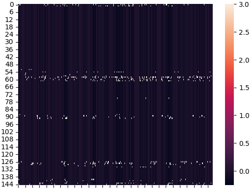
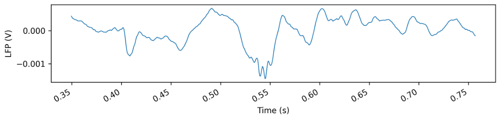

# NeuropixelsLFPOnRamp

## Description
A Repo showcasing how to process and analyze Neuropixels LFP from the two largest publicly available datasets the ABI Visual Behaviour and the IBL dataset

### CCF_reannotation
Guide on how to reannotate CCF cooridnates to a more detailed brain atlas or brain atals other than the Allen Institutes Atlas.

### Example Notebooks (Tutorials)
This directory contains jupyter example notebooks that demonstrate how each steps of the SWR extraction works and how to compare LFP to behavioural variables for running analyses.  Explains hwo to create and test your own filters, how to compute power, dimensionality reduction on LFP, and basic inferential statistical analyses that can be done using these methods.  Versions for the IBL and ABI are provided, or at least code for how to extract the same information.

Notebooks include: 
    Reannotation fo the brain atlas to other atalses or more detailed versions of ABI using the CCF values provided.
    Visualization of steps in ExtractingSWRs code, example artifacts are shown and example LFP events.
    Filters construction and testing notebook.
    Statistical analysis notebook - tbd

### conda_env_ymls
YAML files for setting up the Conda environments used in this project.

### Core
Core funcitons used in many files here.

### ExtractingSWRs
Code which loops through ABI and IBL sessions to generate the SWR dataset.  Because the IBL and ABI api's have conflicting requirements it is necessary to write scripts for each.  Multiprocessing is implemented.  Soon these will be put into a snakemake pipeline to provide an example of how to build reproducible workflows.

