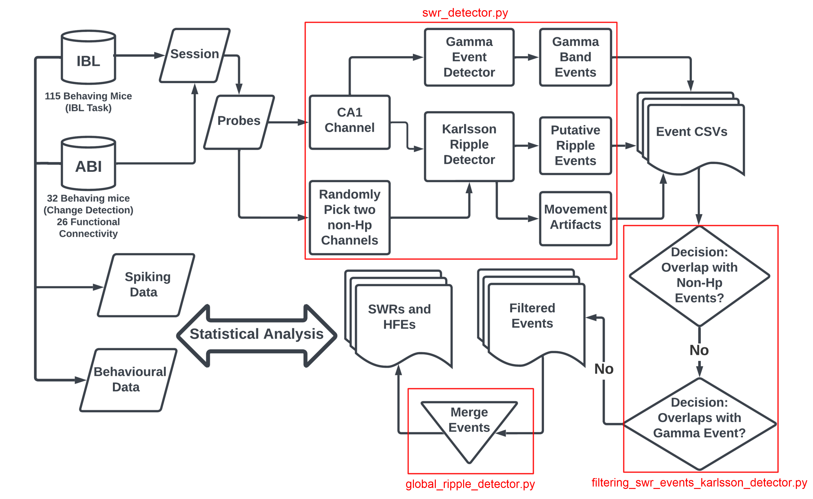

# Mouse Hippocampal Sharp Wave Ripple Dataset Curated From Public Neuropixels Datasets



## Description
A repo showcasing how to process and analyze Neuropixels LFP from the two largest publicly available datasets: the ABI Visual Behaviour and the IBL dataset.

### conda_env_ymls

Contains the .yaml files for recreating the environments used to run the allensdk and associated codes, as well as the .yaml for the ONE_ibl_env conda environment to run the IBL associated code.

### DetectingSWRs

Contains the pipelines for running the detection scripts. Each pipeline contains a config file which sets input and output as well as parameters of the pipeline, such as ripple envelope threshold, and whether to include or exclude gamma band events when computing the global level events. If one wishes to rerun the detection pipelines, these config files can be modified accordingly.

#### Example Usage
1. Start a `tmux` session (as the code can take a while to run):
    ```bash
    tmux
    ```

2. Activate the `allensdk_env` conda environment:
    ```bash
    conda activate allensdk_env
    ```

3. Change directory to the pipeline folder:
    ```bash
    cd DetectingSWRs/ABI_VisBehave_Pipeline
    ```

4. Ensure the config file, `abi_visbehave_swr_config.yaml`, is set to use the appropriate number of cores that your machine can handle.

5. Run the detection scripts in the following order:
    ```bash
    python abi_visbehave_swr_detector.py
    python abi_visbehave_filtering_swr_events_karlsson_detector.py
    python abi_visbehave_global_ripple_detector.py
    ```

6.  Use ctrl+b, d to exit the tmux session without killing it. It is recomended to check htop to ensure the server is behaving appropriately.

Note:  We have also created scripts for running the pipelines on slurm for shared computing clusters.  (Will be provided)

### Figures and Technical Validation

Contains notebooks to create the images in the Background & Summary as well as the Technical Validation section. Includes methods for visualizing the ripples and methods for visualizing probe position in brainrender. In the IBL validation notebook, there are also methods for plotting the CSD plots.

- **ABI_visbehave_validation.ipynb**: All code is for the ABI Visual Behavior data. Contains code showing how to plot the probe in CA1 in brainrender for this dataset (Figure 1A). Includes plots for the theta power during ripples, wheel speed during ripples, ripple power, and duration distributions (Figure 6). Ripple power and duration also contain the sum of squares and Kolmogorov-Smirnov tests for the distribution fits of the normal, half-normal, and log-normal distributions.  Code to generate summary of ABI Visual Behavior in table 1 provided as well.  Run in the `allensdk_env`.

- **ABI_viscoding_validation.ipynb**: All code is for the ABI Visual Coding data. Contains code showing the example ripple across many probes (Figure 1D). Contains code showing how to plot the probe in CA1 in brainrender for this dataset (Figure 1A). Includes plots for the theta power during ripples, wheel speed during ripples, ripple power, and duration distributions (Figure 6). Ripple power and duration code also contain the sum of squares and Kolmogorov-Smirnov tests for the distribution fits of the normal, half-normal, and log-normal distributions.  Code to generate summary of ABI Visual Coding in table 2 provided as well.  Run in the `allensdk_env`.

- **IBL_validation.ipynb**: Most code is for the IBL Decision Making Task data, though there are also parts summarizing all the datasets (to be moved to their own notebook). Contains code showing how to plot the probe in CA1 in brainrender for this dataset (Figure 1C). Additionally, contains code to generate the CSD plot across one of the IBL probes (Figure 1). This was done in the IBL because the sampling density of the shared data was greater than in the ABI datasets. Includes Venn diagrams and bar plots summarizing the dataset, which uses data from the other two datasets (Figure 1F, G). Contains code visualizing putative SWRs shown against gamma-band event artifacts (Figure 4) and movement artifacts (Figure 5). Finally, contains code for the plots for the theta power during ripples, wheel speed during ripples, ripple power, and duration distributions of the IBL data (Figure 6). Ripple power and duration code also contain the sum of squares and Kolmogorov-Smirnov tests for the distribution fits of the normal, half-normal, and log-normal distributions.  Code to generate summary of IBL mice in Table 3 provided as well.  Run in the `ONE_ibl_env`.

- **figures**: folder containing images generated by the notebooks saved as .svg.  These were then used in inkscape to create the publication figures.

### Images

Images for the repo.

### PowerBandFilters

The code used to create the filters for the SWR detection pipelines.  Uses environment for [mne package with core dependencies](https://mne.tools/stable/install/manual_install.html#installing-mne-python-with-core-dependencies).


